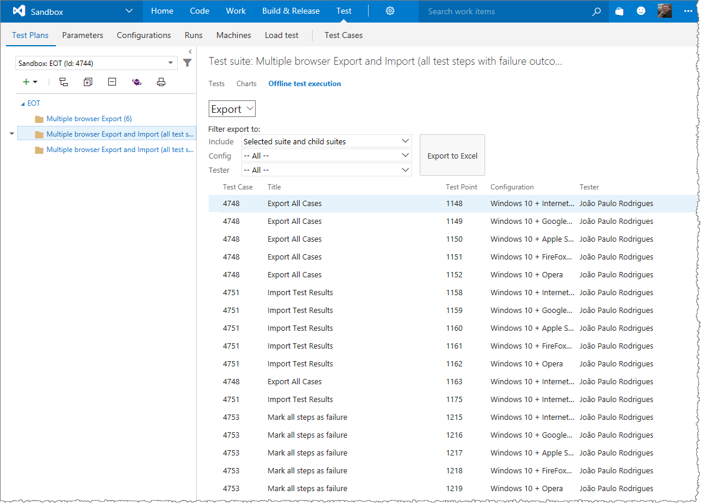
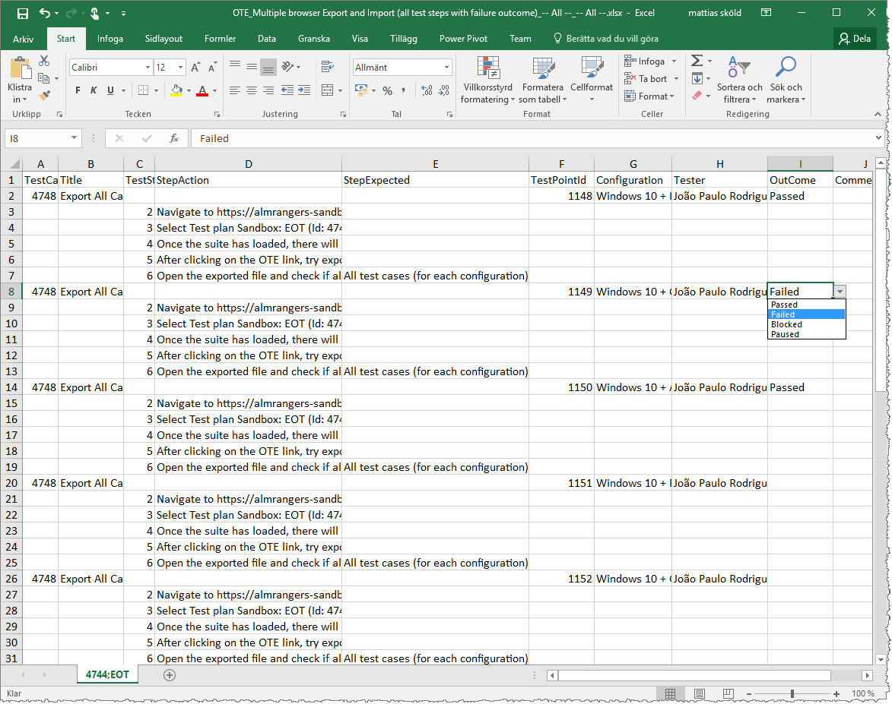
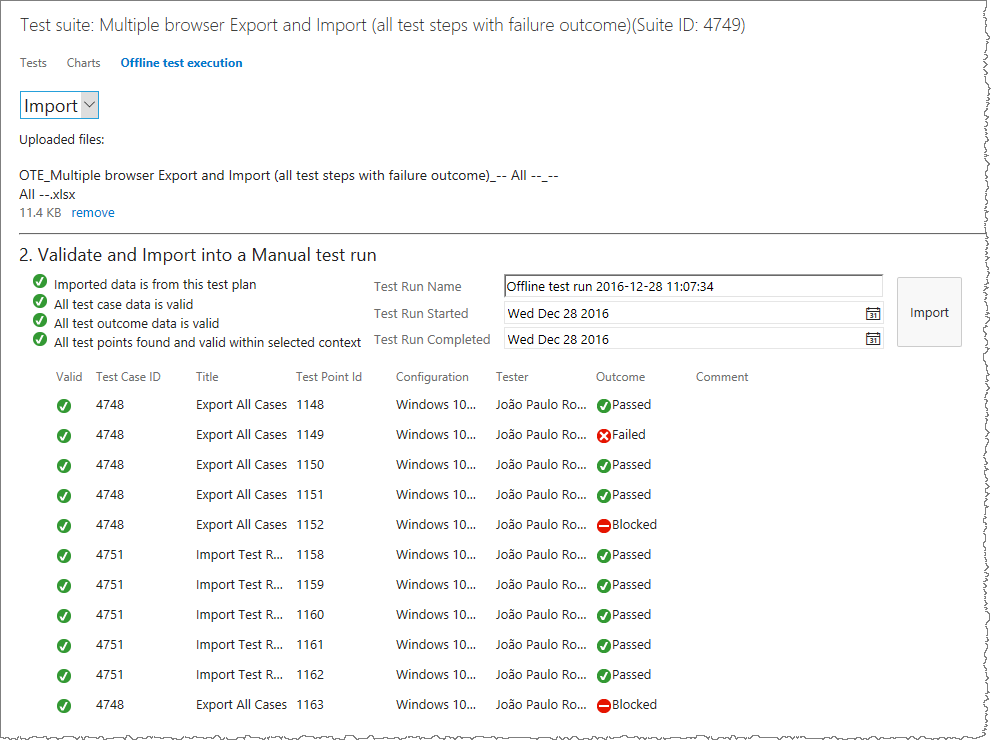

# Offline-Test-Execution-extension

## Export and execute test cases offline and import the outcome to the test plan ##
Sometimes the need for execute test cases without connection to the Visual Studio Team Services (VSTS). This extension lets you export your planed test cases to an excel file. With the Excel file, you can mark test cases as passed or failed in an offline environment, and the use the tool to import the outcome back to the test plan. 

### Export ###
Export the entire test plan, or a filtered selection, to an Excel file. Filter the export to the entire test plan, the selected suite with or without children, configuration and/or tester before exporting. 

### Offline execution ###
View test cases offline in excel and mark them as passed, failed or blocked.

### Import outcome ###
Import the outcome from excel to your test plan.

## Pricing
**Free**, but only VSTS users (not stakeholders) can be assigned the Test Case Explorer extension. Learn more about [VSTS Feature Matrix](https://www.visualstudio.com/team-services/compare-features/) and [VSTS Pricing](https://aka.ms/vs-pricing).

> Microsoft DevLabs is an outlet for experiments from Microsoft, experiments that represent some of the latest ideas around developer tools. Solutions in this category are designed for broad usage, and you are encouraged to use and provide feedback on them; however, these extensions are not supported nor are any commitments made as to their longevity.

## Contributors
We thank the following contributor(s) for this extension: [Mattias Skold](https://blogs.msdn.microsoft.com/willy-peter_schaub/2011/03/28/introducing-the-visual-studio-alm-rangers-mattias-skld/), [Josh Garverick](https://blogs.msdn.microsoft.com/willy-peter_schaub/2014/09/10/introducing-the-visual-studio-alm-rangers-josh-garverick/), [Utkarsh Shigihalli](https://blogs.msdn.microsoft.com/willy-peter_schaub/2013/07/05/introducing-the-visual-studio-alm-rangers-utkarsh-shigihalli/) and [Hosam Kamel](https://blogs.msdn.microsoft.com/willy-peter_schaub/2011/10/19/introducing-the-visual-studio-alm-rangers-hosam-kamel/).

## Feedback

We need your feedback! Here are some ways to connect with us:

- Add a comment in the Q&A section below and please add an actionable review.
- Send us an [email](mailto://mktdevlabs@microsoft.com).

Review the [list of features and resolved issues of latest tools and extensions](https://aka.ms/vsarreleases) for information on the latest releases.

Notices for certain third-party software included in this extension are provided here: [Third Party Notice](ThirdPartyNotice.txt).

## Contribute
Contributions are welcome. Here is how you can contribute:  

- Submit bugs and help us verify fixes  
- Submit pull requests for bug fixes and features and discuss existing proposals   

Please refer to [Contribution guidelines](.github/CONTRIBUTING.md) and the [Code of Conduct](.github/COC.md) for more details.

[View Notices](https://marketplace.visualstudio.com/_apis/public/gallery/publisher/ms-devlabs/extension/OfflineTestExecution/latest/assetbyname/ThirdPartyNotice.txt) for third party software included in this extension.